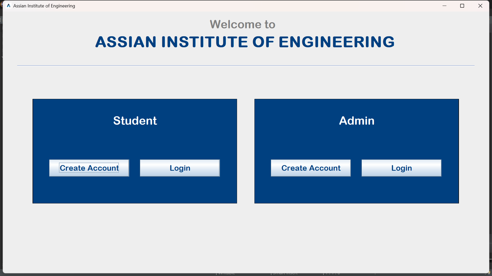
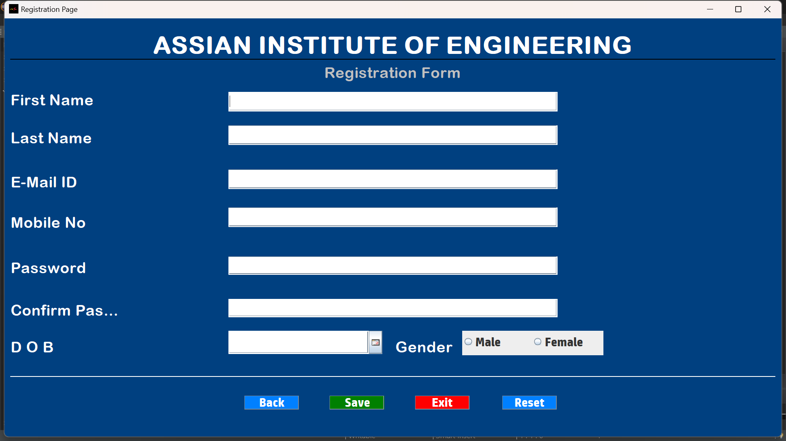
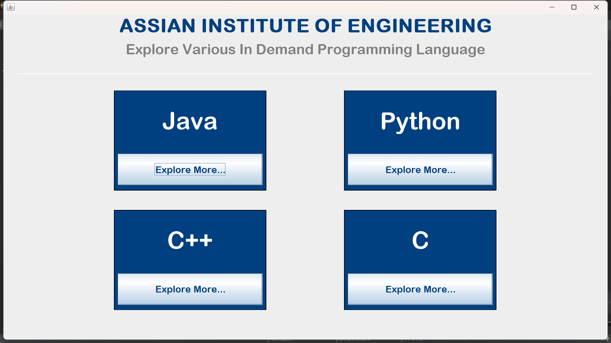
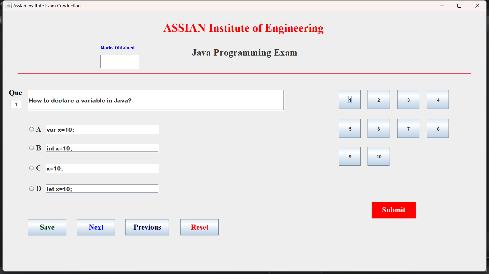

# Exam Conduction and Management System

A robust Java-based application designed to streamline the process of managing student data, scheduling exams, and automating exam-related workflows with an intuitive graphical user interface (GUI).

## Features
- **Student and Exam Management**: Add, update, and manage student information and exam schedules efficiently.
- **Graphical User Interface (GUI)**: User-friendly and interactive interface built with Java WindowBuilder for seamless navigation.
- **Database Integration**: Securely store and retrieve data using MySQL.
- **Validation and Error Handling**: Ensure input accuracy and prevent data inconsistencies with built-in validation mechanisms.

## Technologies Used
- **Programming Language**: Java
- **GUI Development**: Java Swing (WindowBuilder)
- **Database**: MySQL
- **Tools and Libraries**:
  - JDBC for database connectivity
  - Eclipse IDE for development

## How It Works
1. **Student Registration**: Users can add new students with details such as name, roll number, and class.
2. **Exam Scheduling**: Create, edit, or delete exam schedules and assign students to exams.
3. **Data Management**: View, search, and update existing student or exam records.
4. **Validation and Feedback**: The system provides real-time validation and feedback for incorrect inputs or errors.

## Demo Previw
1. **Authentication Preview**:



2. **Registration Form Preview**:



3. **Categories Preview**:



4. **Exam Preview**:



5. **Admin Validation Preview**:


## Installation and Setup
1. Clone the repository:
   ```bash
   git clone https://github.com/your-username/exam-conduction-management.git
